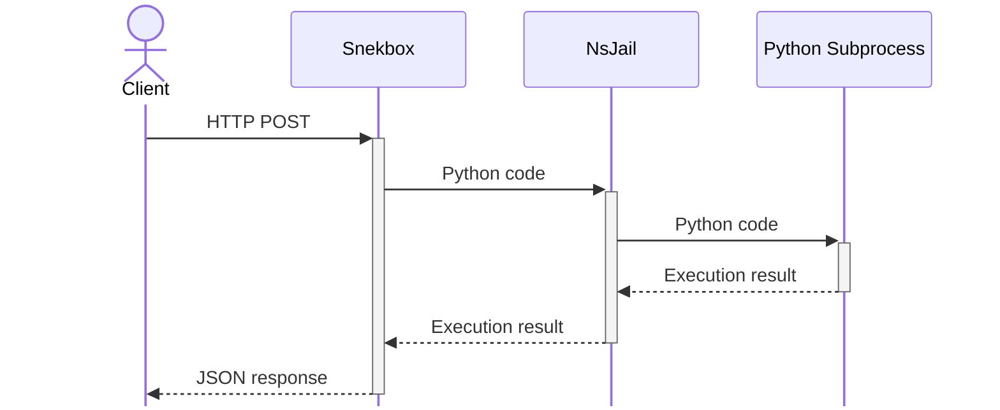

[![Discord][5]][6]
[![Build Status][1]][2]
[![Coverage Status][3]][4]
[](LICENSE)

# snekbox

Python sandbox runners for executing code in isolation aka snekbox.

A client sends Python code to a snekbox, the snekbox executes the code, and finally the results of the execution are returned to the client.



The code is executed in a Python process that is launched through [NsJail], which is responsible for sandboxing the Python process.

The output returned by snekbox is truncated at around 1 MB by default, but this can be [configured](#gunicorn).

## HTTP REST API

Communication with snekbox is done over a HTTP REST API. The framework for the HTTP REST API is [Falcon] and the WSGI being used is [Gunicorn]. By default, the server is hosted on `0.0.0.0:8060` with two workers.

See [`snekapi.py`] and [`resources`] for API documentation.

## Running snekbox

A Docker image is available in the [GitHub Container Registry]. A container can be started with the following command, which will also pull the image if it doesn't currently exist locally:

```
docker run --ipc=none --privileged -p 8060:8060 ghcr.io/python-discord/snekbox
```

To run it in the background, use the `-d` option. See the documentation on [`docker run`] for more information.

The above command will make the API accessible on the host via `http://localhost:8060/`. Currently, there's only one endpoint: `http://localhost:8060/eval`.

## Configuration

Configuration files can be edited directly. However, this requires rebuilding the image. Alternatively, a Docker volume or bind mounts can be used to override the configuration files at their default locations.

### NsJail

The main features of the default configuration are:

* Time limit
* Memory limit
* Process count limit
* No networking
* Restricted, read-only filesystem

NsJail is configured through [`snekbox.cfg`]. It contains the exact values for the items listed above. The configuration format is defined by a [protobuf file][7] which can be referred to for documentation. The command-line options of NsJail can also serve as documentation since they closely follow the config file format.

### Gunicorn

[Gunicorn settings] can be found in [`gunicorn.conf.py`]. In the default configuration, the worker count, the bind address, and the WSGI app URI are likely the only things of any interest. Since it uses the default synchronous workers, the [worker count] effectively determines how many concurrent code evaluations can be performed.

`wsgi_app` can be given arguments which are forwarded to the [`NsJail`] object. For example, `wsgi_app = "snekbox:SnekAPI(max_output_size=2_000_000, read_chunk_size=20_000)"`.

### Environment Variables

All environment variables have defaults and are therefore not required to be set.

Name | Description
---- | -----------
`SNEKBOX_DEBUG` | Enable debug logging if set to a non-empty value.
`SNEKBOX_SENTRY_DSN` | [Data Source Name] for Sentry. Sentry is disabled if left unset.

## Third-party Packages

By default, the Python interpreter has no access to any packages besides the
standard library. Even snekbox's own dependencies like Falcon and Gunicorn are
not exposed.

To expose third-party Python packages during evaluation, install them to a custom user site:

```sh
docker exec snekbox /bin/sh -c 'PYTHONUSERBASE=/snekbox/user_base pip install numpy'
```

In the above command, `snekbox` is the name of the running container. The name may be different and can be checked with `docker ps`.

The packages will be installed to the user site within `/snekbox/user_base`. To persist the installed packages, a volume for the directory can be created with Docker. For an example, see [`docker-compose.yml`].

If `pip`, `setuptools`, or `wheel` are dependencies or need to be exposed, then use the `--ignore-installed` option with pip. However, note that this will also re-install packages present in the custom user site, effectively making caching it futile. Current limitations of pip don't allow it to ignore packages extant outside the installation destination.

## Development Environment

See [CONTRIBUTING.md](.github/CONTRIBUTING.md).


[1]: https://github.com/python-discord/snekbox/workflows/Lint,%20Test,%20Build,%20Push/badge.svg?branch=main
[2]: https://github.com/python-discord/snekbox/actions?query=workflow%3A%22Lint%2C+Test%2C+Build%2C+Push%22+branch%3Amain
[3]: https://coveralls.io/repos/github/python-discord/snekbox/badge.svg?branch=main
[4]: https://coveralls.io/github/python-discord/snekbox?branch=main
[5]: https://raw.githubusercontent.com/python-discord/branding/main/logos/badge/badge_github.svg
[6]: https://discord.gg/python
[7]: https://github.com/google/nsjail/blob/master/config.proto
[`gunicorn.conf.py`]: config/gunicorn.conf.py
[`snekbox.cfg`]: config/snekbox.cfg
[`snekapi.py`]: snekbox/api/snekapi.py
[`resources`]: snekbox/api/resources
[`docker-compose.yml`]: docker-compose.yml
[`docker run`]: https://docs.docker.com/engine/reference/commandline/run/
[nsjail]: https://github.com/google/nsjail
[falcon]: https://falconframework.org/
[gunicorn]: https://gunicorn.org/
[gunicorn settings]: https://docs.gunicorn.org/en/latest/settings.html
[worker count]: https://docs.gunicorn.org/en/latest/design.html#how-many-workers
[sentry release]: https://docs.sentry.io/platforms/python/configuration/releases/
[data source name]: https://docs.sentry.io/product/sentry-basics/dsn-explainer/
[GitHub Container Registry]: https://github.com/orgs/python-discord/packages/container/package/snekbox
[`NsJail`]: snekbox/nsjail.py
